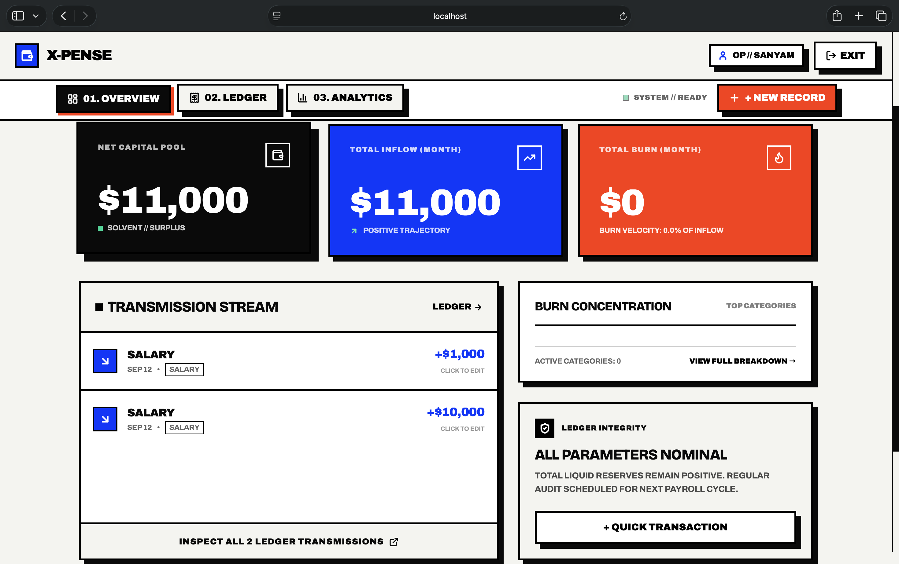
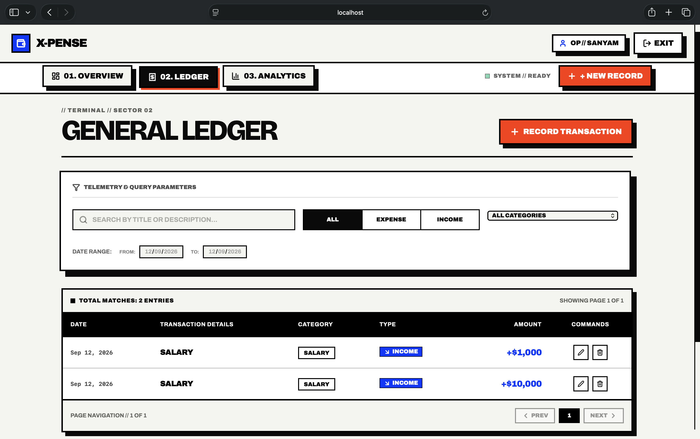
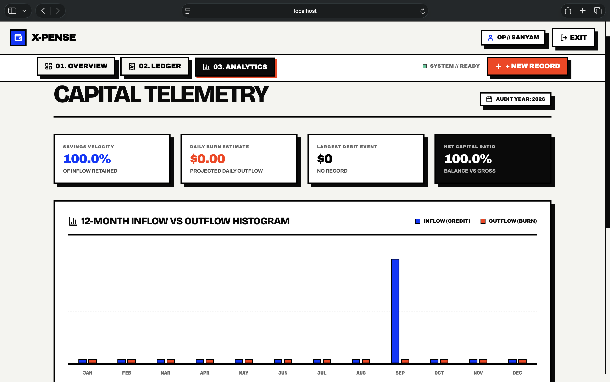
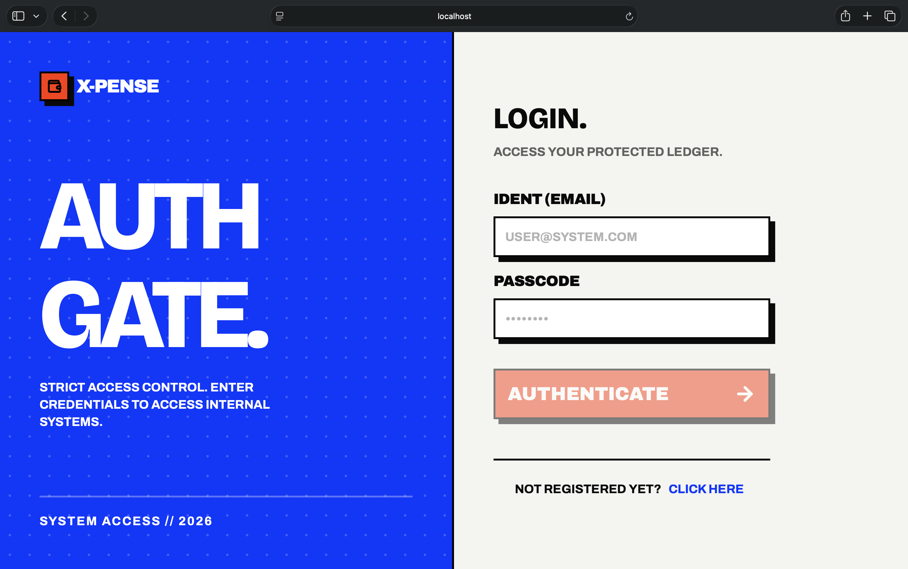
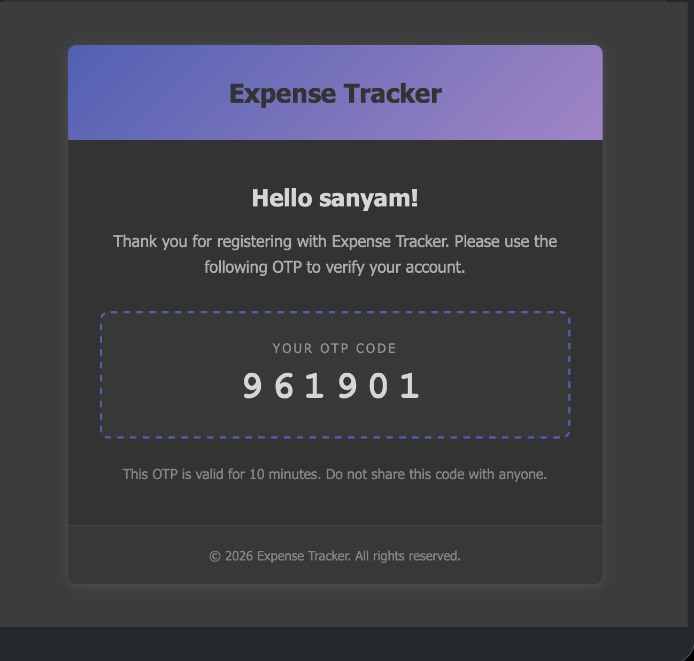

# X-Pense | Brutal

Stop using soft, floaty apps to manage hard-earned currency. **X-Pense** is a brutalist-style expense tracker for those who demand total control over their financial data. No mercy for bad data. Engineered for immediate response.

## Screenshots

<div align="center">
  
  <br/>
  <em>System v2.0 Live - Brutalist Landing</em>
</div>

<br/>

<div align="center">
  
  <br/>
  <em>Strict Access Control Auth Gate</em>
</div>

<br/>

<div align="center">
  
  <br/>
  <em>Dashboard Overview</em>
</div>

<br/>

<div align="center">
  
  <br/>
  <em>Transactions Ledger</em>
</div>

<br/>

<div align="center">
  
  <br/>
  <em>Precision Analytics</em>
</div>

## Features

- **Hyper Fast UI:** Brutalist design using Tailwind CSS v4 and Framer Motion.
- **Bulletproof Authentication:** Secure JWT-based auth utilizing `HttpOnly`, `SameSite=lax` cookies to protect your session.
- **Precision Logging:** Create, edit, and organize financial transactions.
- **Data Visualization:** In-depth analytics for your spending habits.
- **Secure Backend:** Express v5 + MongoDB securely storing your data.

## Tech Stack

### Frontend
- **Framework:** React 19 + Vite 8
- **Routing:** React Router v7
- **Styling:** Tailwind CSS v4
- **Icons & Animation:** Lucide React, Framer Motion
- **Data Fetching:** Axios

### Backend
- **Server:** Node.js + Express v5
- **Database:** MongoDB + Mongoose
- **Auth:** JWT (JSON Web Tokens) + bcryptjs
- **Security:** CORS, Cookie Parser

## Quick Start

### 1. Backend Setup

```bash
cd backend
npm install
```

Create a `.env` file in the `backend` directory with your secrets:
```env
PORT=4000
MONGO_URI=your_mongodb_connection_string
JWT_SECRET=your_jwt_secret
COOKIE_SECRET=development
```

Start the backend server:
```bash
npm run dev
```

### 2. Frontend Setup

```bash
cd frontend
npm install
```

Create a `.env` file in the `frontend` directory:
```env
VITE_API_URL=http://localhost:4000/api
```

Start the frontend development server:
```bash
npm run dev
```

## System Access
Access the client via the URL provided by Vite (usually `http://localhost:5173`). 
*Note: Due to secure cookie configurations, always ensure you access the app via `localhost` rather than `127.0.0.1` to avoid cross-origin cookie rejection by modern browsers.*
